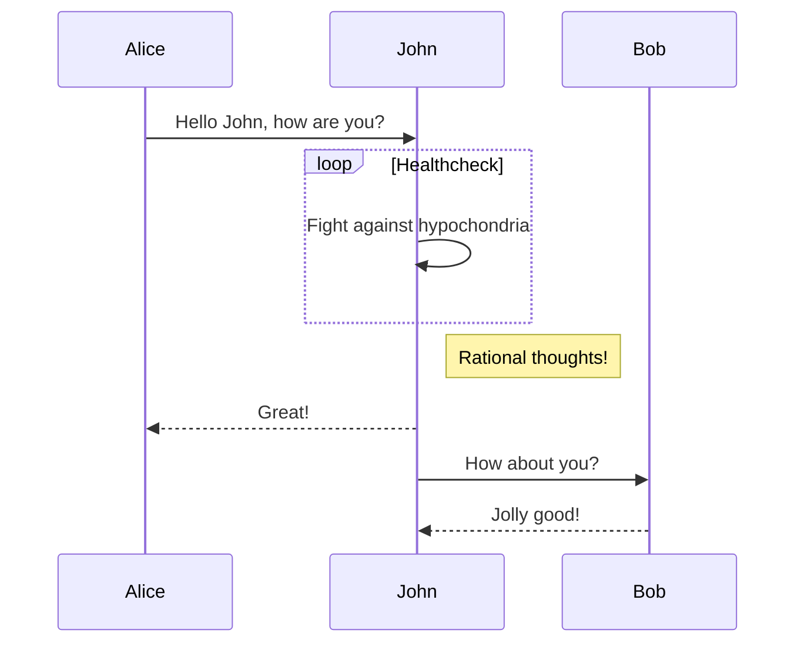
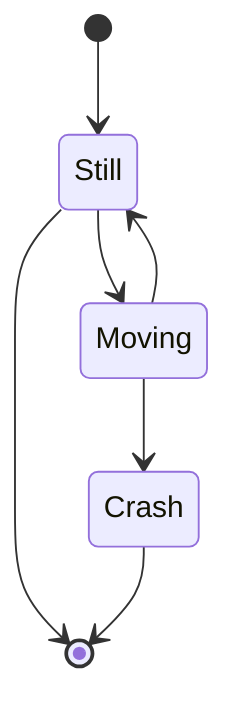
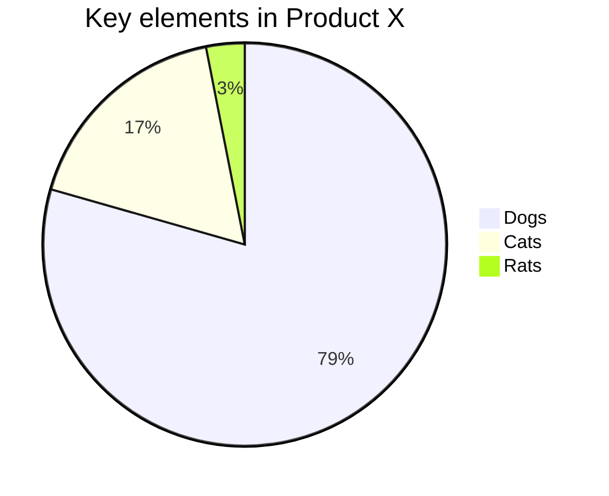
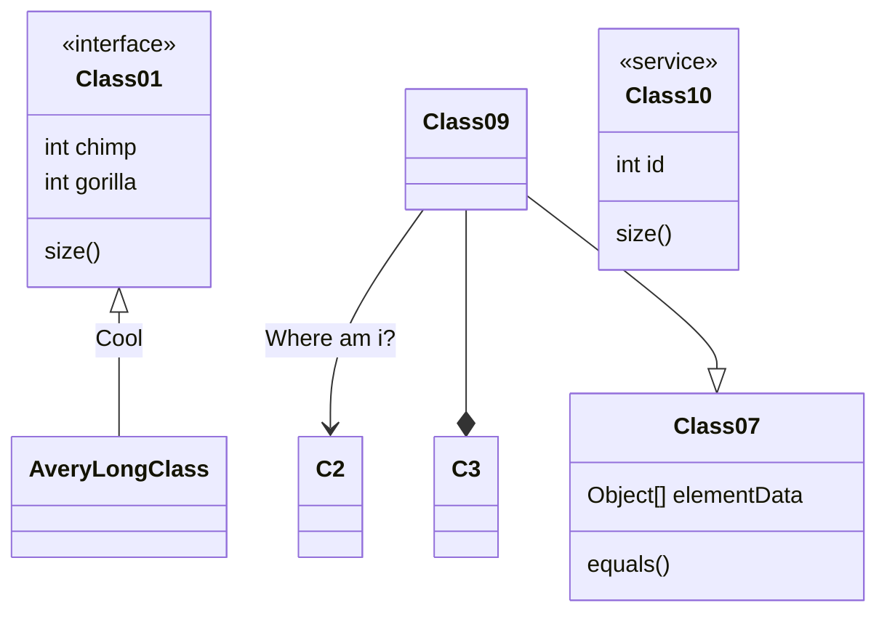
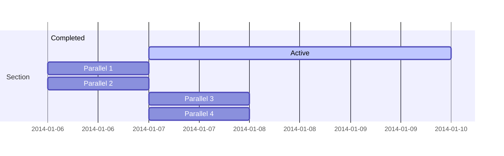

# Quick start

{{description}}

!> An awesome project's another page.

## Math

### Inline

Here's some math: $a = \frac{b + c}{2}$. It's rendered inline.

### Blocks

Here's a formula on its own line, becoming a block element:

$$\sum_{i=0}^n i^2 = \frac{(n^2+n)(2n+1)}{6}$$

#### Multiline

Here's a block of math whose source spans multiple lines:

$$
\begin{aligned}
a_{n+1} &= \frac{x_{n+1} + nc_n}{n+1} \\
\iff a_{n+1} &= a_n + \frac{x_{n+1} - a_n}{n+1}
\end{aligned}
$$

### Code

Here is math in a code fence, which is not rendered:

```
$$
\begin{aligned}
a_{n+1} &= \frac{x_{n+1} + nc_n}{n+1} \\
\iff a_{n+1} &= a_n + \frac{x_{n+1} - a_n}{n+1}
\end{aligned}
$$
```

### List Items

Here's the same formula has a list item:

- $$\sum_{i=0}^n i^2 = \frac{(n^2+n)(2n+1)}{6}$$

### Blockquotes

Math in a blockquote:

> Here's some inline math: $a = \frac{b + c}{2}$.
>
> A formula on its own:
>
> $$\sum_{i=0}^n i^2 = \frac{(n^2+n)(2n+1)}{6}$$
>
> A multiline block of math:
>
> $$
> \begin{aligned}
> a_{n+1} &= \frac{x_{n+1} + nc_n}{n+1} \\
> \iff a_{n+1} &= a_n + \frac{x_{n+1} - a_n}{n+1}
> \end{aligned}
> $$

### Tables

Math in a table:

| Foo                   | Bar
| --------------------- | -------
| $a = \frac{b + c}{2}$ | $$\sum_{i=0}^n i^2 = \frac{(n^2+n)(2n+1)}{6}$$ |
| $d = \frac{e + f}{2}$ | $$\sum_{j=0}^m j^2 = \frac{(m^2+m)(2m+1)}{6}$$ |

## Tabs

### Examples

<!-- tabs:start -->

#### **English**

Hello!

#### **French**

Bonjour!

#### **Italian**

Ciao!

<!-- tabs:end -->

### Code

<!-- tabs:start -->

<!-- tab:Kotlin -->
```kotlin {highlight:"2,10"}
launch {
  val request = Client.Request("{...JSON configuration...}").apply {
    // Configure handler for error messages
    errorMessageHandler = ErrorMessageHandler(myLogger)

    // Configure supported image types
    supportedImageTypes = setOf("image/png", "image/webp")
  }

  request.send(ctx).success?.let {
    // Start using the client
    useClient(it)
  }
}
/**
 * Code can contain [links](https://github.com/) too!
 */
```

<!-- tab:Swift -->
```swift {highlight:"1,7"}
var request = ClientRequest(configuration: "{...JSON configuration...}")
request.errorMessageHander = { message in
  print("*** ERROR: \(message)")
}
request.supportedImageTypes = ["image/png", "image/webp"]

request.send { result in
  switch result {
    case let .failure(error):
      print("Client request error: \(error.localizedDescription)")
      break
    case let .success(client):
      // Save the reference
      useClient(client)
      break
  }
}
/**
 * Code can contain [links](https://github.com/) too!
 */
```

<!-- tabs:end -->

The tabs are synchronized, and persisted in local storage.

<!-- tabs:start -->

<!-- tab:Kotlin -->
```kotlin
val message = "This is Kotlin"
```

<!-- tab:Swift -->
```swift
let message = "This is Swift"
```

<!-- tabs:end -->

`This generic code isn't syntax-highlighted`, but [`/* this inline Swift code is: */ var request = ClientRequest(configuration: "{...JSON configuration...}")` swift].

## Diagrams

### Sequence



### State Diagram



### Pie Chart



### Class Diagram



### Gantt Chart


